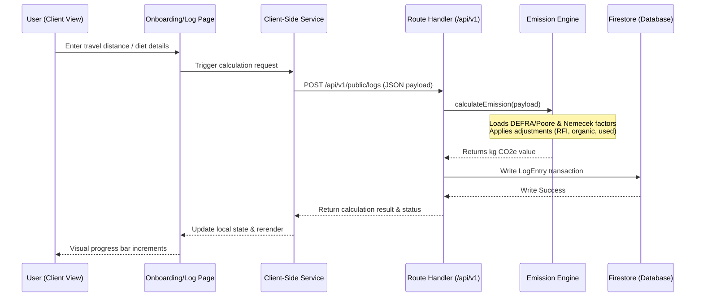

# EarthPrint System Architecture

This document describes the high-level architecture, workspaces structure, and data flows of the EarthPrint platform.

---

## 1. Monorepo Workspaces Layout

EarthPrint is designed as a modular **Turborepo monorepo** using npm workspaces. The dependency graph splits UI components, typing guidelines, and mathematical calculation models into isolated packages:

```mermaid
graph TD
    root[package.json Workspace] --> web[web Next.js Web App]
    root --> packages[packages/* Libraries]
    root --> functions[functions Firebase Cloud Functions]
    
    packages --> types[@earthprint/types]
    packages --> ui[@earthprint/ui]
    packages --> engine[@earthprint/emission-engine]

    web -.-> |Depends on| types
    web -.-> |Depends on| ui
    web -.-> |Depends on| engine
    
    engine -.-> |Depends on| types
    ui -.-> |Depends on| types
    functions -.-> |Depends on| types
```

---

## 2. Workspace Roles & Descriptions

1. **`web/` (Next.js 14 Web App):**
   * Employs the Next.js **App Router** for rendering and page serving.
   * Houses front-end view layout pages (dashboard, awareness hub, onboarding wizard, marketplace) and protected route structures.
   * Leverages a dedicated **Service Layer** (`services/`) to broker data queries and isolate Firestore rules/AI queries.
2. **`packages/emission-engine/` (Emissions Math Service):**
   * A standalone, dependency-free JavaScript library representing the carbon logic domain.
   * Compiles and loads carbon factors from seed JSONs statically at build time.
   * Encapsulates transport distance, diet lifecycle, grid intensity, and spend factors.
3. **`packages/types/` (Global Type Manifest):**
   * Exports core interface contracts (`UserProfile`, `LogEntry`, `AIRecommendation`, `Badge`) used by the client app, emission engine, and Firebase Functions.
4. **`packages/ui/` (Design System Tokens):**
   * Holds the design system visual definitions (Sage/Forest deep theme colors, borders, typography maps).
5. **`functions/` (Firebase Cloud Functions):**
   * Scheduled cron jobs and database triggers run on GCF v2 (e.g. streaming log documents to BigQuery, Daily streak decay computations, Weekly recommendation tips).

---

## 3. Core Calculations Data Flow


